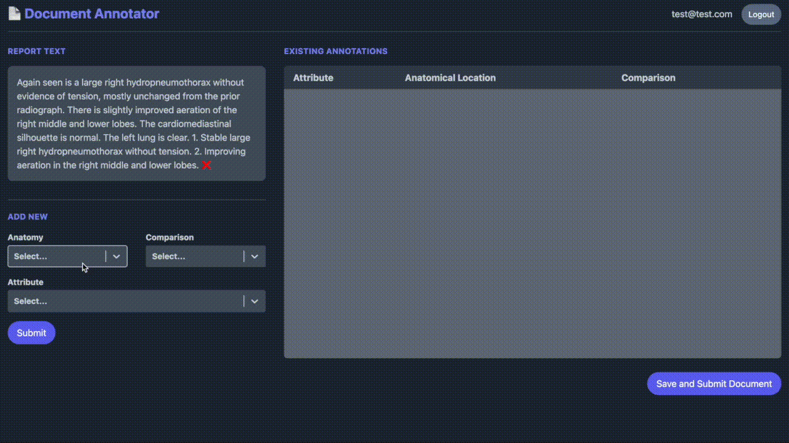

# Document Annotator
A webapp to collect annotations for text documnets. This project was originally intended to facilitate the collection of manual annotations of temporal changes recorded in radiology reports.

(Temporal changes, such as a condition worsening, improving or remaining the same, is a vital part of clinical practice and is relevant from diagnosis through to treatment. However this information is almost invariably omitted from manual annotation schemas and downstream model development/evaluation.)

## Annotation

Annotation options can be found (and modified) in ```./app/utils/options.ts```. Currently previous files cannot be edited by the user and attempts to access are blocked and redirected to homepage.

## User accounts
Documents are randomly allocated to users, and each document can have multiple annotators. Document annotations are tied to individual users to allow for downstream validation of annotator accuracy, concordance etc. User accounts enabled using auth0. 

## Data source
To populate database from directory of individual .txt documents (e.g. MIMIC-CXR reports):

```
python generate_json.py --input=INPUT_DIR --output=data/data.json
```

Then run `./reset_db.sh` (or `prisma db seed` individually)

## Stack

- TypeScript
- Remix
- Tailwind CSS
- Prisma SQLite
- auth0
